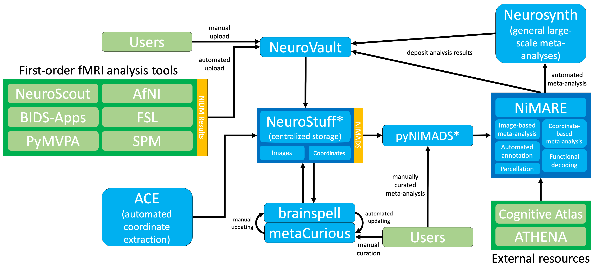

.. include:: links.rst

About NiMARE
============

NiMARE is a Python package for performing meta-analyses, and derivative analyses
using meta-analytic data, of the neuroimaging literature.
While meta-analytic packages exist which implement one or two algorithms each, NiMARE
provides a standard syntax for performing a wide range of analyses and for interacting
with databases of coordinates and images from fMRI studies (e.g., brainspell, Neurosynth,
and NeuroVault).

NiMARE joins a growing Python ecosystem for neuroimaging research, which includes such
tools as `Nipype`_, `Nistats`_, and `Nilearn`_. As with these other tools, NiMARE is open
source, collaboratively developed, and built with ease of use in mind.

This page outlines NiMARE's purpose and its role in a proposed meta-analytic
ecosystem.

A Proposed Meta-Analytic Ecosystem
----------------------------------



NiMARE aims to fill a gap in a burgeoning meta-analytic ecosystem.
The goal of NiMARE is to collect a wide range of meta-analytic tools in one
Python library.
Currently, those methods are spread out across a range of programming languages
and user interfaces, or are never even translated from the original papers into
useable tools.
NiMARE operates on NIMADS-format datasets, which users will be able to compile
by searching the NeuroStuff database with the pyNIMADS library.
A number of other services in the ecosystem will then use NiMARE functions to
perform meta-analyses, including Neurosynth 2.0, `NeuroVault`_, and
`metaCurious`_.

.. note::
  This page outlines a *tentative* plan for a system of services
  for neuroimaging meta-analysis.
  Several of the services detailed here do not currently exist or only partially
  support the functionality described below.
  This plan is likely to change over time.

Neurosynth 2.0
``````````````
`Neurosynth`_ currently stores a coordinated-based database of over 14,000
neuroimaging papers (automatically curated by `ACE`_), provides a web interface
for automated meta-analyses, functional decoding, and gene expression
visualization, and provides a Python package implementing the above methods.

In order to improve modularization, the next iteration of Neurosynth will limit
itself to a web interface for meta-analytic model specification and providing a
centralized storage for large-scale meta-analyses, but not actually
implementing the algorithms used to run those meta-analyses or to perform the
other services provided on the website (e.g., functional decoding and topic
modeling).
The algorithms currently implemented in the `Neurosynth Python package`_ will be
implemented (among many others) in NiMARE.
Under the current plan, the database at the moment stored by Neurosynth will
instead by stored in the NeuroStuff database, which will also store other
coordinate- and image-based meta-analytic databases in NIMADS format.

NeuroVault
``````````
`NeuroVault`_ is a database for unthresholded images.
Users may upload individual maps or `NIDM Results`_, which can be exported from
a number of fMRI analysis tools, like `AfNI`_, `SPM`_, `FSL`_, and
`NeuroScout`_.

NeuroVault also has integrations with `NeuroPower`_ (for power analyses) and
`Neurosynth`_ (for functional decoding), and supports simple image-based
meta-analyses.

brainspell
``````````
`brainspell`_ is a clone of the Neurosynth database meant for crowdsourced
manual annotation.
It provides a website where users can correct mistakes made by ACE or can add
labels from multiple cognitive ontologies (including the
`Cognitive Paradigm Ontology`_ and the `Cognitive Atlas`_) to experiments.

metaCurious
```````````
`metaCurious`_ is a new frontend (i.e., website) for brainspell, oriented toward
meta-analysts.
MetaCurious provides search and curation tools for researchers to build
meta-analytic samples for analysis.
Search criteria, reasons for exclusion, and other labels may be added by the
researcher and fed back into the underlying database, resulting in
goal-oriented manual annotation.
MetaCurious generates GitHub repositories for meta-analytic samples, which
will also be NiMARE-compatible in the future.

NIMADS
``````
NIMADS is a new standard for organizing and representing meta-analytic
neuroimaging data.
NIMADS will be used by NeuroStuff, pyNIMADS, `metaCurious`_, and NiMARE.

NeuroStuff
``````````
NeuroStuff (tentatively named) will act as a centralized repository for
coordinates and maps from neuroimaging studies, stored in NIMADS format.
Users will be able to query and add to the repository using its API and the
pyNIMADS Python library.

pyNIMADS
````````
pyNIMADS (also tentatively named) is a planned Python library that will act as
a wrapper for the NeuroStuff API, allowing users to query the database and to
build NiMARE-compatible datasets for analysis.
