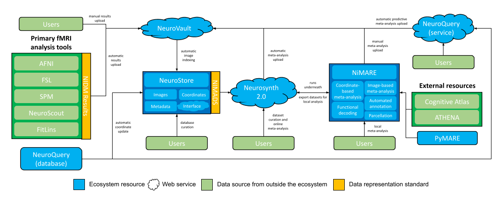

.. include:: links.rst

About NiMARE
============

NiMARE is a Python package for performing meta-analyses, and derivative analyses using meta-analytic data, of the neuroimaging literature.
While meta-analytic packages exist which implement one or two algorithms each,
NiMARE provides a standard syntax for performing a wide range of analyses and for interacting with databases of coordinates and images
from fMRI studies (e.g., brainspell, Neurosynth, and NeuroVault).

NiMARE joins a growing Python ecosystem for neuroimaging research, which includes such tools as `Nipype`_, `Nibabel`_, and `Nilearn`_.
As with these other tools, NiMARE is open source, collaboratively developed, and built with ease of use in mind.

This page outlines NiMARE's purpose and its role in a proposed meta-analytic ecosystem.


NiMARE's Scope and Roadmap
--------------------------

NiMARE's primary goal is to consolidate coordinate- and image-based meta-analysis methods with a simple, shared and comprehensive interface.
This should reduce brand loyalty to any given algorithm, as it should be easy to employ the most appropriate algorithm for a given project.
NiMARE also provides an environment where comparisons between methods are easier to perform.

A secondary goal of NiMARE is to implement some of the more cutting-edge methods for analyses built on meta-analytic neuroimaging data.
There are many tools or algorithms that use meta-analytic data, including automated annotation, meta-analytic functional characterization analysis, and meta-analytic parcellation.
Many of these methods are either tied to a specific meta-analysis package or never make it from publication to useable (i.e., documented and tested) code.


NiMARE's Role in a Proposed Meta-Analytic Ecosystem
---------------------------------------------------

.. important::
  For more up-to-date information and for information about other elements in the ecosystem,
  please see `neurostuff.github.io <https://neurostuff.github.io>`_.



NiMARE aims to fill a gap in a burgeoning meta-analytic ecosystem.
The goal of NiMARE is to collect a wide range of meta-analytic tools in one Python library.
Currently, those methods are spread out across a range of programming languages and user interfaces,
or are never even translated from the original papers into useable tools.
NiMARE operates on NIMADS-format datasets, which users will be able to compile by searching the NeuroStore database with the pyNIMADS library.
A number of other services in the ecosystem will then use NiMARE functions to perform meta-analyses, including Neurosynth 2.0 and `NeuroVault`_.


Other Meta-Analytic Tools
-------------------------

Outside of the shared ecosystem detailed above, there are a number of tools.


Coordinate-based meta-analysis tools
````````````````````````````````````

`BrainMap`_: The `BrainMap`_ suite includes applications for the ALE CBMA algorithm (via the `GingerALE`_ app) and
interacting with the BrainMap database (via the `Sleuth`_ and `Scribe`_ apps).

The `MKDA Toolbox`_: This toolbox implements the MKDA algorithm, as well as a range derivative analyses.

The `SDM`_ Toolbox: This toolbox contains the hybrid coordinate/image-based seed-based d-mapping algorithm.

`NeuRoi Toolbox`_: This toolbox contains an implementation of the `Analysis of Brain Coordinates`_ (ABC) CBMA algorithm.


Image-based meta-analysis tools
```````````````````````````````

`IBMA SPM extension`_: This SPM extension implements a number of image-based meta-analysis algorithms.


Meta-analysis tools for other neuroimaging modalities
`````````````````````````````````````````````````````

`ERPscanr`_: A resource for semi-automated, large-scale meta-analyses of ERP data.

