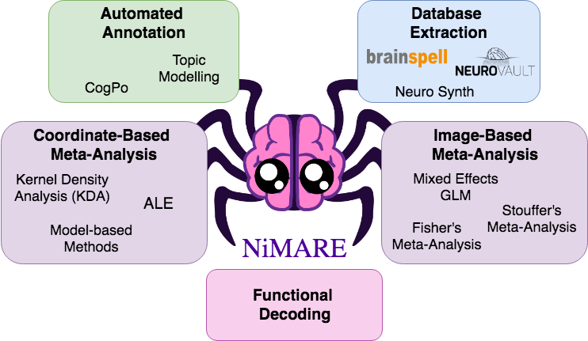

.. include:: <isonum.txt>

NiMARE: Neuroimaging Meta-Analysis Research Environment
==========================================================

NiMARE is a Python package for neuroimaging meta-analyses.
It makes conducting scary meta-analyses a dream!

To install NiMARE check out our `installation guide`_.

.. image:: https://img.shields.io/pypi/v/nimare.svg
   :target: https://pypi.python.org/pypi/nimare/
   :alt: Latest Version

.. image:: https://img.shields.io/pypi/pyversions/nimare.svg
   :target: https://pypi.python.org/pypi/nimare/
   :alt: PyPI - Python Version

.. image:: https://zenodo.org/badge/117724523.svg
   :target: https://zenodo.org/badge/latestdoi/117724523
   :alt: DOI

.. image:: https://img.shields.io/badge/License-MIT-blue.svg
   :target: https://opensource.org/licenses/MIT
   :alt: License

.. image:: https://circleci.com/gh/neurostuff/NiMARE.svg?style=shield
   :target: https://circleci.com/gh/neurostuff/NiMARE
   :alt: CircleCI

.. image:: https://readthedocs.org/projects/nimare/badge/?version=latest
   :target: http://nimare.readthedocs.io/en/latest/?badge=latest
   :alt: Documentation Status

.. image:: https://codecov.io/gh/neurostuff/NiMARE/branch/master/graph/badge.svg
   :target: https://codecov.io/gh/neurostuff/nimare
   :alt: Codecov

.. image:: https://img.shields.io/badge/code%20style-black-000000.svg
   :target: https://github.com/psf/black
   :alt: Code style: black

.. image:: https://img.shields.io/badge/mattermost-join_chat%20%E2%86%92-brightgreen.svg
   :target: https://mattermost.brainhack.org/brainhack/channels/nimare
   :alt: Join the chat

.. image:: https://img.shields.io/badge/RRID-SCR__017398-blue.svg
  :target: https://scicrunch.org/scicrunch/Resources/record/nlx_144509-1/SCR_017398/resolver?q=nimare&l=nimare
  :alt: RRID:SCR_017398

.. _installation guide: installation.html

.. toctree::
  :maxdepth: 2
  :caption: Contents:

  about
  installation
  api
  auto_examples/index
  contributing
  dev_guide
  roadmap
  cli
  outputs

Indices and tables
------------------

* :ref:`genindex`
* :ref:`modindex`
* :ref:`search`
