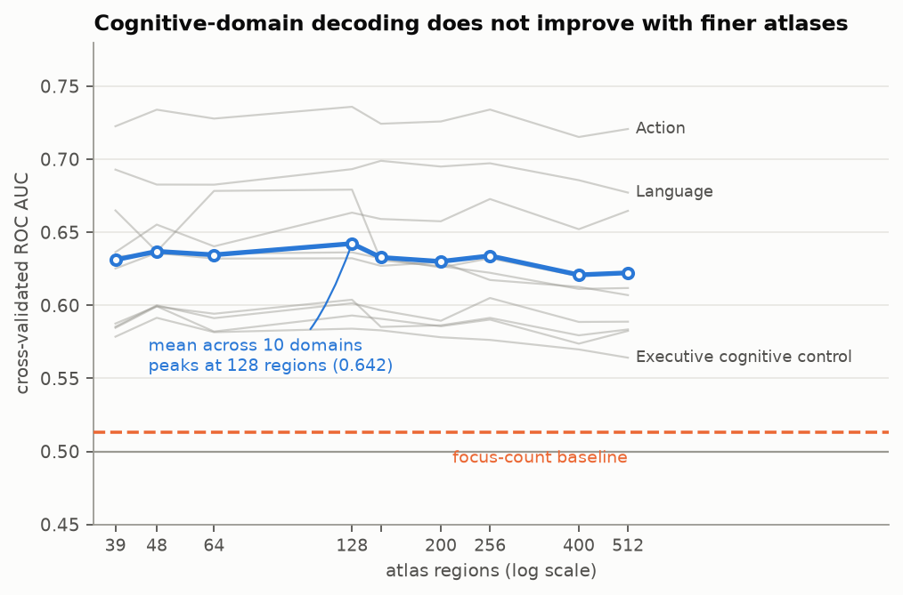
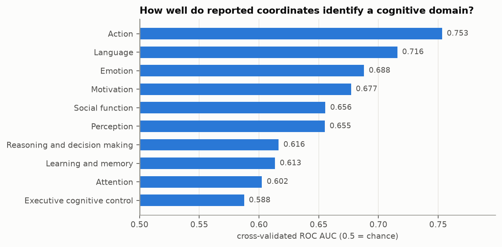
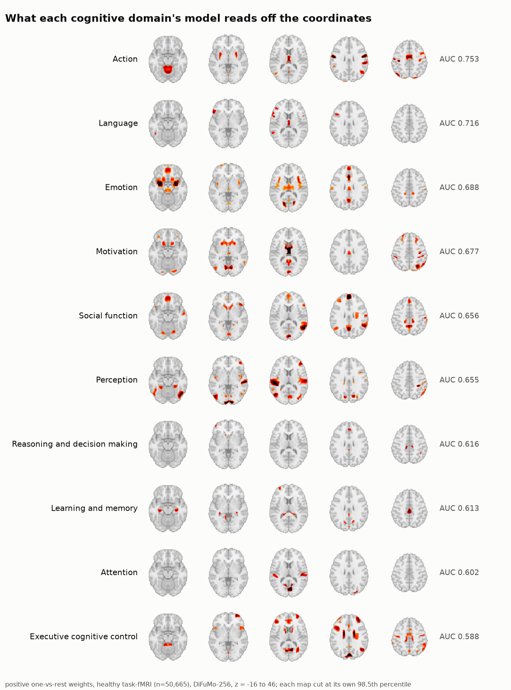
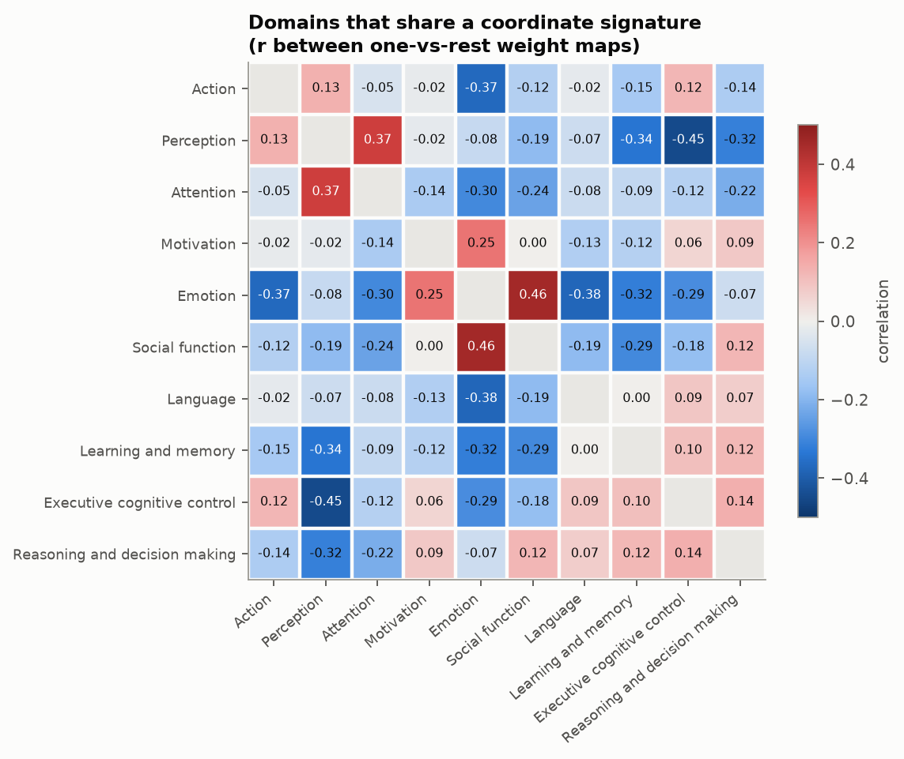
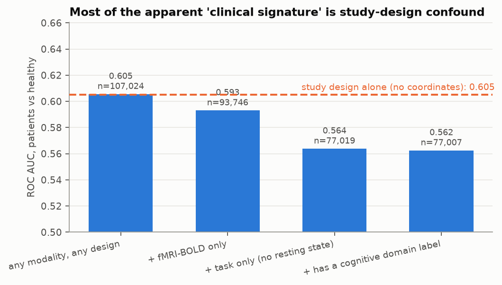
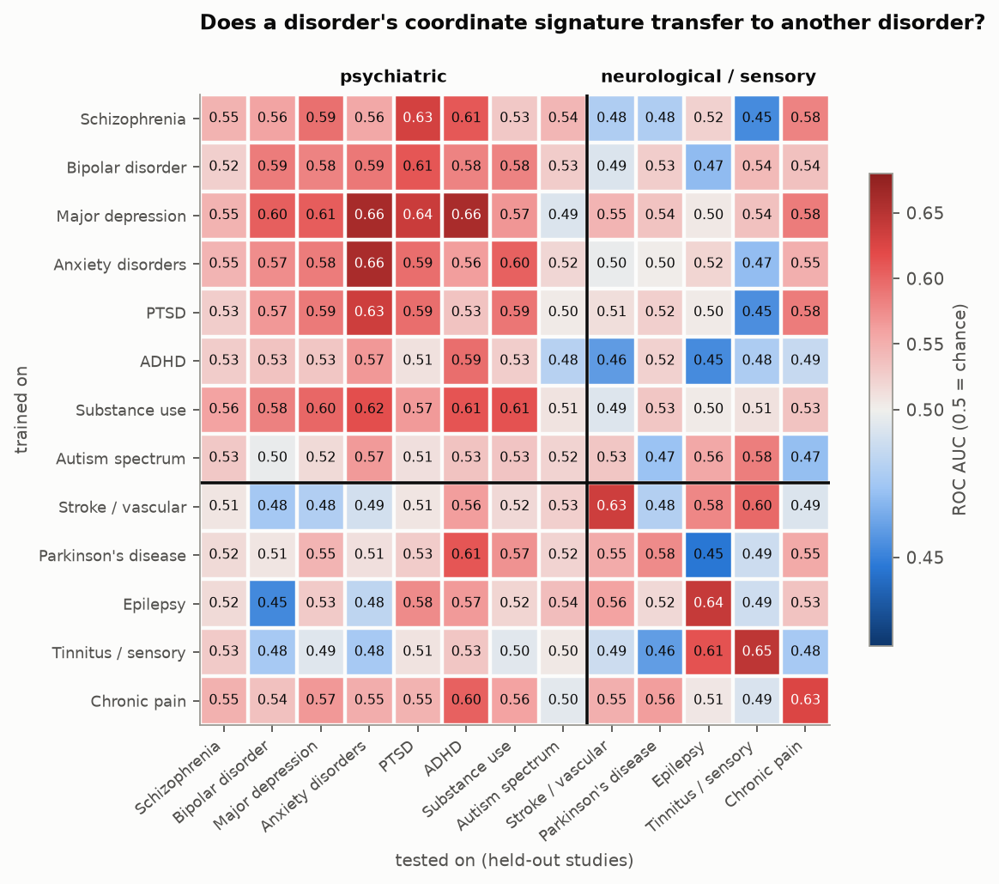
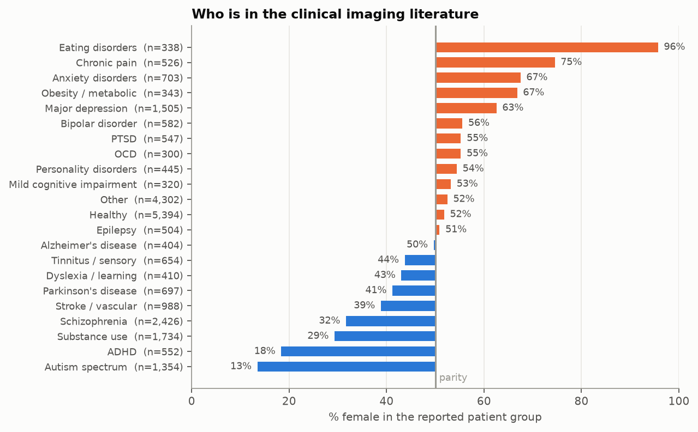

# Exploring the NeuroStore nightly studyset with `nimare.ml`

An exploration of the rolling nightly NeuroStore release — what is in it, what
has to be normalized before it can be modelled, and what it can be asked about
cognitive and clinical neuroscience.

*Release: `nightly`, built 2026-09-28T09:18Z, 38,936 studies / 146,719 notes,
sha256 `05b7a371…5812e`. NiMARE at `78426eb`, scikit-learn 1.9.1, nilearn 0.13.1.*

---

## 1. What is in the release

| table | shape | note |
|---|---|---|
| analyses | 146,736 | from 38,936 studies |
| coordinates | 1,018,893 foci | all resolved to `mni152_2mm` on load |
| metadata | 146,736 × 67 | mostly a long tail of curator-specific keys |
| annotations | 146,736 × 927 | two LLM extractors |
| texts | 146,736 × 3 | **id columns only — no abstracts in this release** |

`describe_fields` reports **988 selectable fields**, but their coverage is a
power law: median coverage 0.008%, and only **27 fields reach 50% coverage**.
Nearly all the modelling value sits in two extractor namespaces:

- `TaskExtractor` (422 fields) — modality, task, cognitive domain, design
- `ParticipantDemographicsExtractor` (502 fields) — group, diagnosis, age, sex, n

Most `metadata` columns are curator debris (`jian`/`xiao`, `possible_mixed`,
`young sampel size`) with coverage under 0.01%. The useful demographic variable
is **not** `metadata.sample_sizes` (0.5% coverage) but
`ParticipantDemographicsExtractor.groups[0].count` (78%).

Foci per analysis: median 4, mean 7.4, max 550. 93.6% of analyses report
coordinates.

---

## 2. What had to be normalized

`nsnorm.py` holds the normalizations; each one was checked against an
independent field before being trusted.

### 2.1 Coordinates: two distinct failure modes

0.42% of foci (4,254, in 1,256 analyses) fall outside any plausible MNI box.
They are not one problem but two:

- **Voxel indices reported as millimetres** — 408 analyses whose foci are *all*
  non-negative and under 200 while most fall outside the brain, e.g.
  `(63, 104, 81)`, `(131, 82, 83)`. These are array indices. For 321 of them
  every single focus is out of range. They are silently wrong rather than
  obviously wrong, because an index in the 40–90 range lands inside the grid
  and becomes a real — but meaningless — brain location.
- **Magnitude corruption** — 247 foci with |coordinate| > 500 mm
  (`z = 2080`, `y = 1190`, `x = 2620`): merged table cells or lost decimal points.

`peak_matrix` already drops foci outside the image grid, so stray typos are
handled; the systematic voxel-index analyses are not, and are dropped explicitly.
QC cost: 110 of 136,969 usable rows.

Also found: **10,758 exactly duplicated foci** within an analysis (1,672
analyses), and 21.3% non-integer coordinates (a normal consequence of
Talairach→MNI transformation, not an error).

### 2.2 Controlled vocabularies drifted

The extractor was given fixed vocabularies and did not stay inside them:

| field | raw values | canonical | examples of drift |
|---|---|---|---|
| `fMRITasks[0].Domain` | 28 | **10** | `Memory`→`Learning and memory`; `Cognitive control`→`Executive cognitive control`; `Motor`/`Motor control`/`Motor function`→`Action` |
| `Modality` | 33 | 9 | `fMRI`, `rsfMRI`→`fMRI-BOLD`; `DTI`→`DiffusionMRI`; `ERP`/`iEEG`/`ECoG`→`Electrophysiology` |
| `TaskDesign` | 12 | 4 | `Resting State`, `Seed-based`, `Vertex-wise` are not task designs at all |

The drift is small in volume (~1% of labels) but it silently fragments
categories — `Memory` and `Learning and memory` would otherwise be two classes.

### 2.3 Diagnosis: 7,455 free-text strings → 31 categories

`groups[0].diagnosis` is unnormalized free text: `Major Depressive Disorder`,
`Major Depressive Disorder (mdd)`, and `Mdd` are three strings for one entity.
An ordered regex vocabulary folds them to 31 categories.

**Validation:** cross-tabulating the result against the independent
`group_name` field, every disorder category lands almost entirely in
`patients` (e.g. Alzheimer's 1414/1414, epilepsy 1316/1316, ADHD 948/955).

### 2.4 Demographic outliers

Mean age ranged to **775,350** and group counts to **101,650**. Screening to
age ∈ [1,100] and n ∈ [1,2000] removes 103 and 1,056 values respectively.
After screening, the median reported group size is **20**.

### 2.5 Two integrity problems worth reporting upstream

- **6,939 analyses (4.7%)** carry `group_name = "patients"` together with a
  diagnosis string that reads plainly healthy (`Healthy`, `Healthy Volunteers`,
  `Neurologically Normal`). The two extractor fields contradict each other.
- **Non-independence:** 936 analyses (1.2% of those reporting ≥4 foci) share a
  byte-identical coordinate set with an analysis in a *different* study — one
  4-focus table appears under 24 distinct study ids. A further 712 analyses
  duplicate a coordinate set *within* their own study. Meta-analyses that
  weight by analysis count will double-count these.

---

## 3. Method

```
Studyset.to_bunch()  →  MAKernel(MKDAKernel(r=10))  →  atlas reduction  →  sklearn
```

Atlas reduction is a **fixed linear operator**, so `fastreduce.py` precomputes it
once (`maps @ operator`) instead of unmasking every row into an image.
Validated against `nimare.ml.MaskerTransformer`: r = 1.0000000000, relative
error 9×10⁻⁶ for a maps atlas (lstsq vs pinv) and 3×10⁻⁸ for a labels atlas —
with a ~1000× speedup on apply, which is what makes a 137k-row × 9-atlas sweep
feasible on 4 cores.

All cross-validation is `GroupKFold` **by study**, so analyses from one paper
never straddle a fold.

**Confound baseline.** Every analysis is checked against a model given only the
number of reported foci. For cognitive domains it sits at chance (AUC
0.488–0.529), so the domain results below are spatial, not "how much was
reported".

---

## 4. Findings

### Q1. Finer atlases do not decode cognition better



Mean ROC AUC over 10 domains, 20,007 analyses, 5,290 studies:

| atlas | regions | mean AUC |
|---|---|---|
| MSDL | 39 | 0.631 |
| Harvard–Oxford | 48 | **0.637** |
| DiFuMo | 64 | 0.635 |
| DiFuMo | 128 | **0.642** |
| Destrieux | 148 | 0.633 |
| Schaefer | 200 | 0.630 |
| DiFuMo | 256 | 0.634 |
| Schaefer | 400 | 0.621 |
| DiFuMo | 512 | 0.622 |

The curve is a shallow inverted U peaking near 128 regions, and 39 regions
already captures 98% of what 512 does. A 48-region anatomical atlas
matches a 512-mode data-driven one. **Atlas choice is not where the leverage
is** — which is useful, because the coarse atlases are ~10× cheaper.

### Q2. Cognitive domains differ enormously in how spatially specific they are



Full healthy task-fMRI sample (50,665 analyses, 13,634 studies, DiFuMo-256):

| domain | AUC | top-weighted regions |
|---|---|---|
| Action | **0.753** | postcentral gyrus, precentral sulcus, thalamus, central sulcus |
| Language | **0.716** | pars opercularis/triangularis LH, IFS LH, ITG LH |
| Emotion | 0.688 | antero-inferior insula, amygdala, mid-anterior cingulate |
| Motivation | 0.677 | anterior commissure (ventral striatum/basal forebrain) |
| Social function | 0.656 | dmPFC, temporal pole, vmPFC, angular gyrus |
| Perception | 0.655 | lateral occipital, STS, inferior occipital |
| Reasoning & decision making | 0.616 | dmPFC, IPS RH, ventral visual stream |
| Learning and memory | 0.613 | anterior hippocampus, amygdala |
| Attention | 0.602 | dorsal visual stream, planum temporale, MFG |
| Executive cognitive control | **0.588** | SFG, MFG, IFS — the multiple-demand network |



The weight maps are textbook-correct without any anatomical prior being
supplied — bilateral amygdala and anterior insula for Emotion, bilateral
hippocampus for Learning and memory, occipital cortex for Perception, medial
prefrontal and temporal cortex for Social function — which is the best
available check that the pipeline is sound. They were read back with
`nimare.ml.coefficient_image`, which walks the fitted pipeline backwards
through the atlas.

The **ordering is the finding**, and it spans a factor of three in
above-chance signal: Action is at +0.253 over chance, executive cognitive
control at +0.088. Every domain is well above chance at these sample sizes —
this is not "control tasks are undecodable" — but domains anchored to
sensorimotor or perisylvian cortex are far more identifiable from coordinates
alone than the control domains are. That is a data-driven restatement of the
multiple-demand / non-specificity problem: a category like *executive
cognitive control* is individuated much more by the task the experimenter ran
than by where the peaks land.

### Q3. The ontology's own similarity structure



Correlations between one-vs-rest weight maps recover a sensible structure that
nobody put in:

- **Emotion ↔ Social function r = +0.46** — the strongest pairing in the matrix
- **Perception ↔ Attention r = +0.37**
- **Emotion ↔ Motivation r = +0.25**
- **Executive control ↔ Perception r = −0.45** — the most opposed pair

Forcing a choice among the ten models on the 6,047 single-domain analyses
(scores rank-normalized so the models are comparable) gives **26.3% top-1
agreement against 10% chance**, but it is very unevenly distributed:

| labelled | recalled |
|---|---|
| Action | 57.9% |
| Language | 45.7% |
| Social function | 37.0% |
| Learning and memory | 24.7% |
| Emotion | 22.0% |
| Attention | 20.7% |
| Perception | 19.3% |
| Executive cognitive control | 18.1% |
| Reasoning and decision making | 17.6% |

The confusions are interpretable rather than random: *Reasoning and decision
making* is most often ranked highest by the **Motivation** model (29.5%) —
valuation circuitry shared between deciding and wanting — and *Perception* is
taken for *Attention* 17.5% of the time.

### Q4. The most-reported regions are not the most diagnostic

Correlation between how often a region is touched at all and how strongly any
domain model leans on it: **r = +0.195**.

The most-reported regions — planum temporale, superior thalamus, posterior
paracingulate, supramarginal gyrus, medial SFG, anterior cingulate — appear in
~56–60% of analyses and carry little domain-specific weight. The most
diagnostic regions are more selective: superior parietal lobule, IPS, temporal
pole, pars opercularis, amygdala.

This is the forward/reverse inference gap, measured directly: the regions the
literature reports most are the ones that tell you least about what the study
was about.

### Q5. Most of the "clinical signature" is study-design confound



Patients vs healthy, tightening the sample at each step:

| sample | n | AUC |
|---|---|---|
| any modality, any design | 107,024 | 0.605 |
| + fMRI-BOLD only | 93,746 | 0.593 |
| + task only (no resting state) | 77,019 | 0.564 |
| + has a cognitive domain label | 77,007 | **0.562** |

The reason is visible in the raw crosstabs: patient analyses are **27.1%
resting-state vs 5.7%** for healthy, and **12.3% structural MRI vs 3.1%**.
Roughly 40% of the above-chance signal is *what kind of study it is*, not
*whose brain it is*.

And the control that matters most:

> Given only the cognitive-domain labels and the focus count — **no coordinates
> at all** — patients vs healthy is predicted at **AUC 0.605**, better than the
> 0.562 the brain coordinates achieve on the same rows.

Within a single cognitive domain the clinical signal is 0.526–0.564 and
essentially flat across domains. A genuine effect is present, but it is small,
and it is smaller than the confound it is usually reported alongside.

### Q6. Psychiatric disorders share a signature; neurological ones do not



Train patients-vs-healthy on one diagnosis, test on **held-out studies of a
different diagnosis** (13 diagnoses with ≥500 task-fMRI analyses):

| | mean AUC |
|---|---|
| psychiatric → psychiatric | **0.563** |
| neurological → psychiatric | 0.525 |
| neurological → neurological | 0.522 |
| psychiatric → neurological | 0.513 |
| *(within-disorder, held out)* | *0.603* |

Psychiatric diagnoses transfer to each other well above the other three blocks.
The strongest cross-disorder pairs are all internalizing: depression→anxiety
0.661, depression→ADHD 0.659, depression→PTSD 0.637, PTSD→anxiety 0.634.

Neurological and sensory conditions are the opposite: high *self* AUC
(tinnitus 0.645, epilepsy 0.640, stroke 0.635) and near-chance transfer —
individually distinctive, mutually unrelated. The one exception,
tinnitus→epilepsy 0.613, is plausibly shared temporal-lobe territory.

This reproduces the transdiagnostic "common psychiatric signature" result from
the coordinate literature rather than from voxelwise data, and shows it is
specific to psychiatry rather than to being a patient.

### Q7. Who the literature actually studies



Sex composition of reported patient groups is severely skewed, and in opposite
directions:

| mostly female | | mostly male | |
|---|---|---|---|
| Eating disorders | 95.7% | Autism spectrum | 13.5% |
| Chronic pain | 74.5% | ADHD | 18.4% |
| Anxiety disorders | 67.5% | Substance use | 29.3% |
| Obesity / metabolic | 66.8% | Schizophrenia | 31.7% |
| Major depression | 62.5% | Stroke / vascular | 38.8% |

By comparison, sex ratios barely move across *cognitive* domains (48.4%–53.5%).
The skew is a property of clinical recruitment, and for autism and ADHD it is
far more extreme than the conditions' own epidemiology.

**Statistical power.** Across 77k task-fMRI analyses with a usable group size:

| | |
|---|---|
| median group size | **20** |
| n ≤ 16 | 37.2% of analyses |
| n ≤ 20 | 55.5% |
| n ≤ 30 | 76.5% |
| n ≤ 100 | 94.2% |

Healthy and patient studies are equally small (median 20 vs 19).

---

## 5. Questions this raises

**For cognitive neuroscience**

1. *Is "executive cognitive control" a brain category or a task category?* It
   decodes at 0.588 and is recalled 18% of the time, against Action's 0.753 and
   58%. A category whose spatial signature is this much weaker than its
   neighbours' — across 50k analyses, so not for want of data — is doing most
   of its work at the task level. Is that the right level for it to sit at in
   a *brain* ontology?
2. *Would a data-driven domain vocabulary beat the curated one?* The confusion
   structure suggests merges (Emotion+Social, Perception+Attention,
   Reasoning+Motivation). Clustering the coordinates first and naming the
   clusters afterwards is now a tractable experiment.
3. *Why does decoding saturate at ~40 regions?* Either reported peaks carry only
   coarse spatial information (plausible: they are sparse, smoothed, and
   thresholded), or the labels are too noisy to reward precision. The
   single-label and unreduced-SVD comparisons in `26_ceiling.py` separate these.

**For clinical neuroscience**

4. *How much published "patient vs control" spatial difference survives design
   matching?* Here the honest estimate is AUC ≈ 0.56, and design metadata alone
   beats it. Any claim of a clinical coordinate signature needs the design
   controls run alongside.
5. *Is the psychiatric transfer a p-factor or a shared-method artifact?* The
   0.563 vs 0.513 block difference is consistent with a common psychiatric
   signature — but psychiatric studies also share task batteries. Matching
   transfer pairs on cognitive domain would separate the two.
6. *What does 13.5% female in autism imaging do to the published maps?*
   Sex-stratified meta-analyses are now possible at scale for depression,
   anxiety, ADHD and autism.

**For the resource itself**

7. The 6,939 `patients`-with-healthy-diagnosis rows and the 321 voxel-index
   analyses are fixable upstream; both silently corrupt downstream models.
8. Should releases ship a canonical vocabulary mapping, so that every user does
   not re-derive `Memory` → `Learning and memory` independently?
9. `texts` is empty in this release — restoring abstracts would allow the LLM
   labels to be checked against the source text.

---

## 6. Files

| path | what |
|---|---|
| `nsnorm.py` | coordinate QC, vocabulary canonicalization, diagnosis normalization |
| `fastreduce.py` | atlas reduction as a linear operator (validated vs `MaskerTransformer`) |
| `scripts/cohort.py` | cohort assembly and sample definitions |
| `scripts/atlases.py` | the atlas ladder |
| `scripts/04_quality.py`, `05_oob.py`, `25_duplicates.py` | data-quality audits |
| `scripts/13_operators.py`, `16_features.py` | feature cache build |
| `scripts/20_domain_sweep.py` | Q1 |
| `scripts/22_ontology.py`, `28_confusion.py` | Q2–Q4 |
| `scripts/21_clinical.py`, `27_blocks.py` | Q5–Q6 |
| `scripts/23_descriptive.py` | Q7 |
| `scripts/24_maps.py` | weight maps via `coefficient_image` |
| `scripts/26_ceiling.py` | atlas vs model vs label-noise probe |
| `scripts/30_figures.py`, `31_map_figure.py` | figures |

Scripts read a cached release via `fetch_neurostore(version="nightly")` and
write intermediates to a scratch directory set at the top of `cohort.py`.
